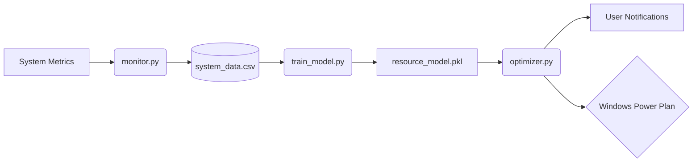

# Green Resource Optimizer 🔋

- A Software Engineering project designed to monitor system resource usage and use Machine Learning to predict and optimize power consumption.

## 📝 Project Summary

- The **Green Resource Optimizer** is an autonomous system designed to reduce PC energy consumption. By analyzing real-time hardware telemetry (CPU, RAM, and Process count), the system utilizes a trained **Random Forest Classifier** to predict user activity states.

When an "Idle" state is detected, the optimizer automatically communicates with the Windows OS to switch the system into **Power Saver** mode, dynamically reverting to **Balanced** mode when activity resumes. This ensures peak performance when needed and maximum efficiency during downtime.

**Key Technical Achievements:**

- Predictive Intelligence: Leveraged a Random Forest model to classify system states with higher accuracy than simple threshold-based scripts.

- Low-Level OS Integration: Implemented direct communication with the Windows powercfg API to perform real-time hardware state transitions.

- Performance Optimization: Designed a variable polling engine to minimize the script's own resource footprint, ensuring the optimizer itself is "green."

## 🚀 Project Goals

- [x] **Phase 1: Data Collection**

  - **Data Source:** Real-time system calls via `psutil` library.
  - **Sampling Rate:** 1 sample every 5-10 seconds.
  - **Data Dictionary:**

| Variable        | Unit                | Description                                 |
| :-------------- | :------------------ | :------------------------------------------ |
| `timestamp`     | YYYY-MM-DD HH:MM:SS | Local system time of capture.               |
| `cpu_usage`     | Percentage (%)      | Aggregate CPU utilization across all cores. |
| `memory_usage`  | Percentage (%)      | Percent of total RAM currently in use.      |
| `process_count` | Integer             | Total number of active PIDs (Process IDs).  |

- [x] **Phase 2: AI Integration**

  - **Algorithm:** Random Forest Classifier (Scikit-Learn)
  - **Features:** CPU Usage, Memory Usage, Process Count
  - **Target Labels:** Idle, Productive, Heavy Load
  - **Validation:** 80/20 Train-Test Split

- [x] **Phase 3: Optimization**

  - **Mechanism:** Live system polling with model inference every 15 seconds.
  - **Action:** Windows desktop notifications to prompt user for Power Saver mode.

## 🚀 Features

- [x] **Active Hardware Control:** Uses Windows `powercfg` API to dynamically swap power plans based on AI inference.

## 🏗️ System Architecture

## 🛠️ Tech Stack

- **Language:** Python
- **Libraries:** `psutil`, `pandas`, `scikit-learn', joblib, windows-toasts`
- **Tools:** Git, VS Code

## 🚀 Installation & Usage

1. **Clone the repository:**
   `git clone https://github.com/aabbiisshhaa/GreenResourceOptimizer.git`
2. **Install dependencies:**
   `pip install -r requirements.txt`
3. **Start monitoring (Run as admin for Power Plan switching):**
   `python optimizer.py`

## 🎓 Learning Outcomes

- This project challenged me to move beyond static code and interact with live system hardware. I learned how to manage software dependencies (migrating to windows-toasts), handle OS-level GUIDs for power management, and transform a machine learning model into a functional background service.
